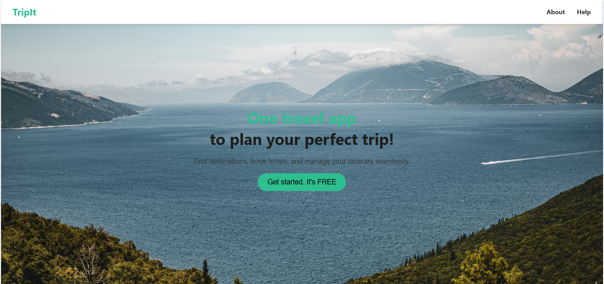
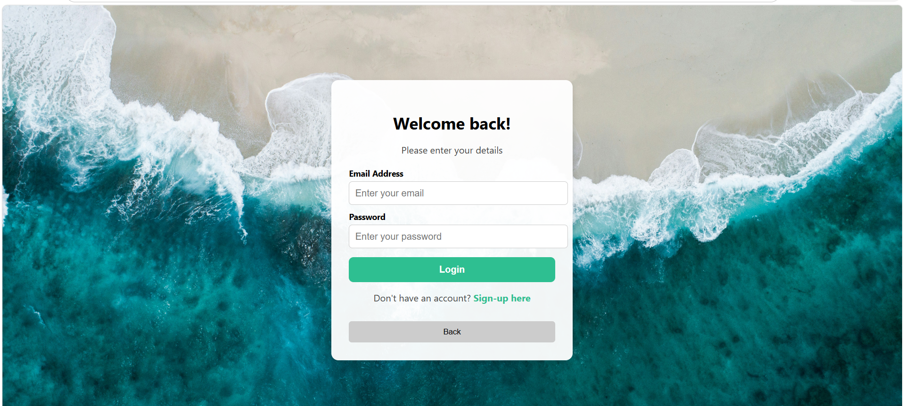
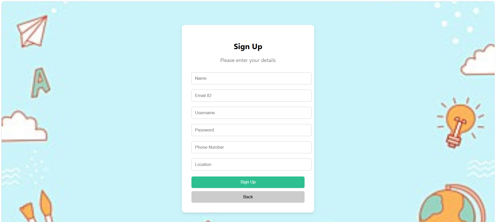
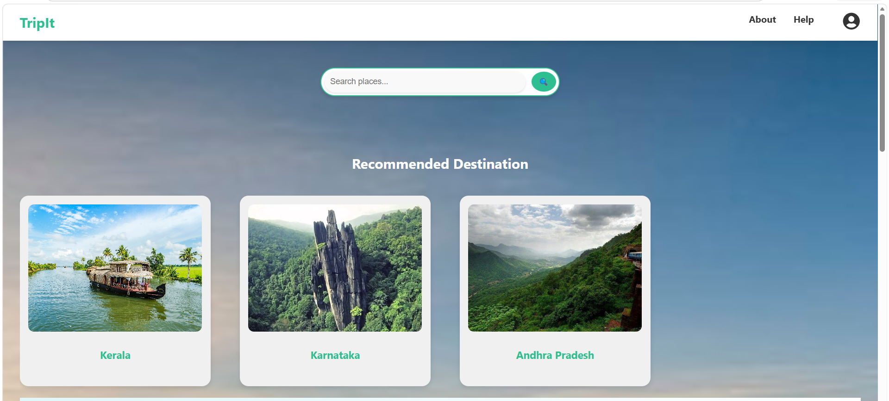
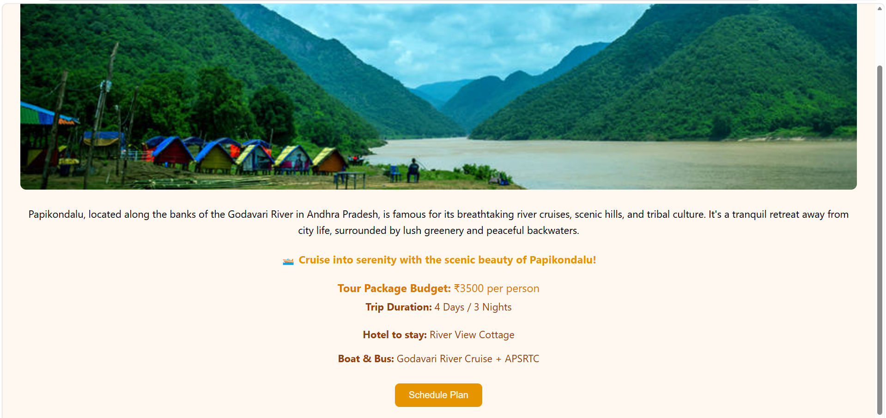
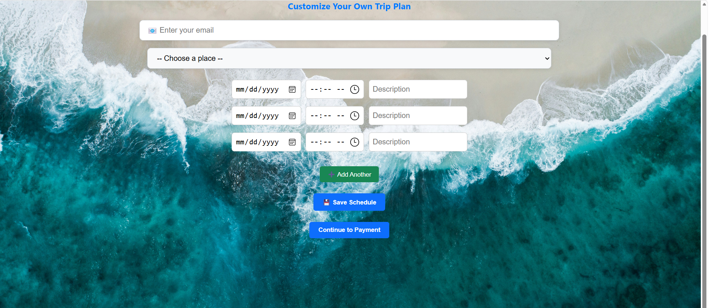
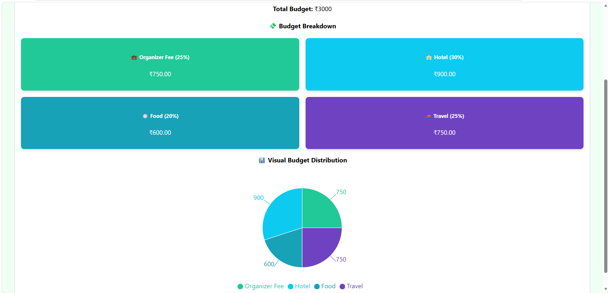

# Travel Planning Web Application

## 1. Project Overview

Travel Planning Web Application is a full-stack MERN application designed to help users plan and organize their trips efficiently. The platform allows users to explore destinations, create customized travel schedules, manage budgets, and store trip plans in a user-friendly interface.

## 2. Live Demo

https://travel-frontend-0hd2.onrender.com

## 3. Features

1. User Registration and Login Authentication.

2. Explore multiple travel destinations across different states.

3. Search and discover tourist attractions.

4. Create personalized travel schedules.

5. Select trip duration, budget, and destination preferences.

6. Store and manage travel plans.

7. View saved schedules in the Task section.

8. Hotel and Flight booking redirection support.

9. Payment confirmation through QR code and screenshot upload.

10. Responsive user interface for desktop and mobile devices.

## 4. Technology Stack

### Frontend

1. React.js

2. HTML5

3. CSS3

4. JavaScript

5. Axios

6. React Router

### Backend

1. Node.js

2. Express.js

3. MongoDB Atlas

4. Mongoose

5. JWT Authentication

6. Bcrypt.js

### Deployment

1. Render

2. GitHub

## 5. Application Workflow

1. Users create an account or log in to the application.

2. Users explore available destinations and travel packages.

3. Users enter travel details including budget, number of travelers, and travel dates.

4. The system generates a travel schedule.

5. Users can customize their itinerary based on preferences.

6. Users proceed with payment verification.

7. Final travel plans are stored and can be viewed later in the Task section.

## 6. Project Structure

Travel-Planner

frontend/

backend/

screenshots/

README.md

## 7. Screenshots

### Landing Page

### Login Page

## Signin Page

### Home Page

### Location Page

### Customize Page

### Budget Tracking Page

## 8. Installation Guide

### Step 1

Clone the repository.

git clone <repository-url>

### Step 2

Navigate to the project directory.

cd Travel-Planner

### Step 3

Install frontend dependencies.

npm install

### Step 4

Install backend dependencies.

npm install

### Step 5

Configure environment variables.

Create a .env file and add the required MongoDB connection string and application settings.

### Step 6

Start the backend server.

node server.js

### Step 7

Start the frontend application.

npm start

## 9. Future Enhancements

1. AI-powered itinerary recommendations.

2. Real-time weather integration.

3. Online hotel booking integration.

4. Flight booking API integration.

5. Travel expense tracking.

6. Interactive maps and route planning.

7. Travel recommendation engine.

## 10. Author

Harini M
